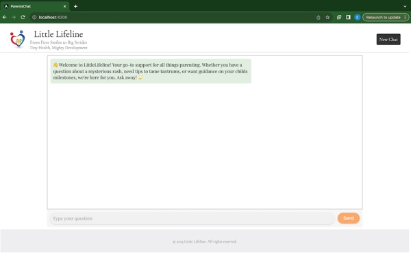
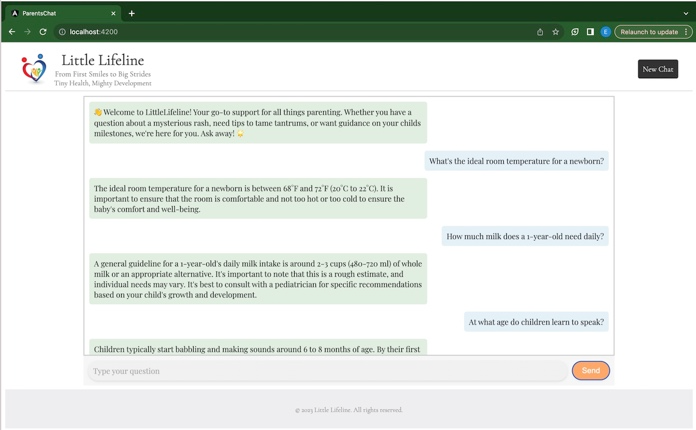
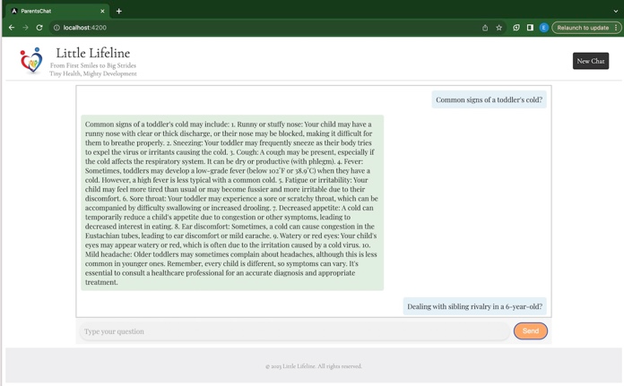

# Little Lifeline: a Parent's AI ChatBot for healthy child development

## Introduction

Little Lifeline, an innovative parenting app that distinguishes itself through a unique combination of advanced technologies. Unlike typical chat bots, our app goes beyond the norm. Opting for Golang in the backend API with GPT 3.5 for server connection, instead of the conventional Python, enhances efficiency and performance. The frontend, developed with Angular, ensures a user-friendly interface.

## Purpose

Little LifeLineChatBot is a dedicated companion on the incredible journey of parenthood. The purpose of Little Lifeline is to provide parents with a trusted support system, offering guidance and insights into the health, well-being, and development of their little ones. Whether you're navigating the early days with a newborn, tackling the toddler years, or exploring the milestones of childhood, LittleLifeline is here to offer a helping hand. From answering questions about your child's health to providing tips on fostering development, the platform is designed to empower parents with the knowledge and support they need to nurture happy and healthy families.

## Usage

Parents can effortlessly seek advice and answers by typing any question into the text field. Powered by GPT 3.5 and a unique Golang backend, the app swiftly processes inquiries and provides accurate, personalized responses.

## Development server

This project was generated with [Angular CLI](https://github.com/angular/angular-cli) version 16.0.4.

Run `ng serve` for a dev server. Navigate to `http://localhost:4200/`. The application will automatically reload if you change any of the source files.
